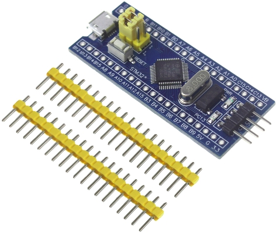

# stm32f103c8t6
Various examples for a low cost development board based on the STM32F103C8T6 MCU
The file openocd.cfg can be used with recent versions of OpenOCD to talk to the
board using an STLink V2 adapter
 

